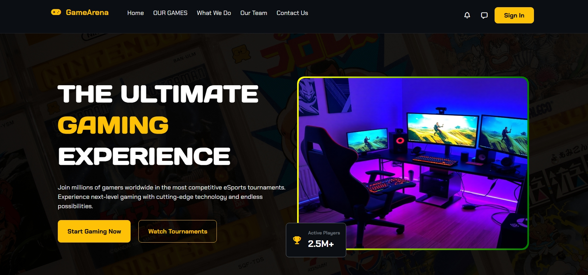
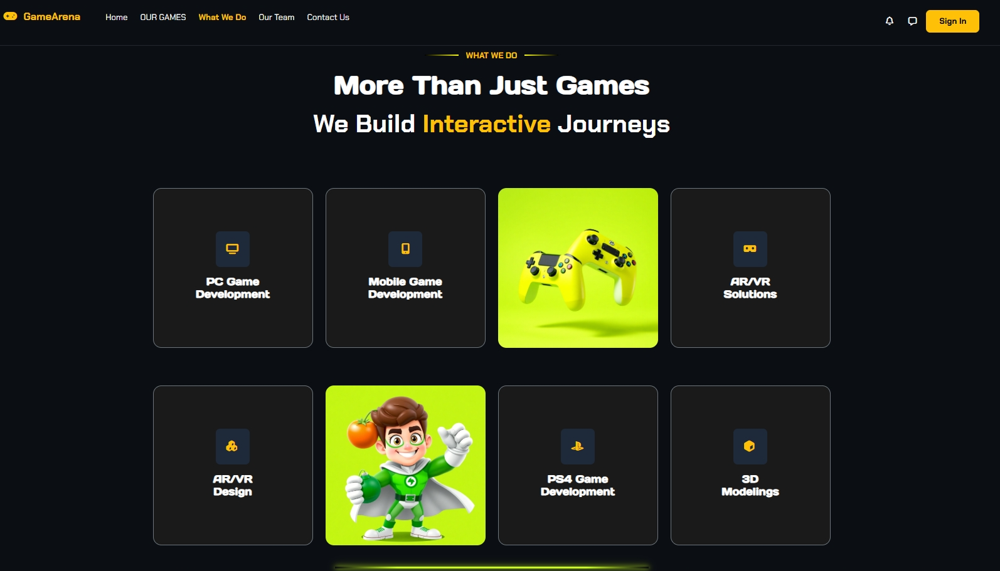
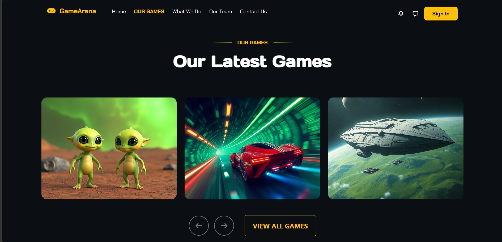
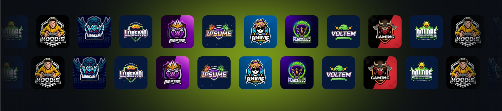
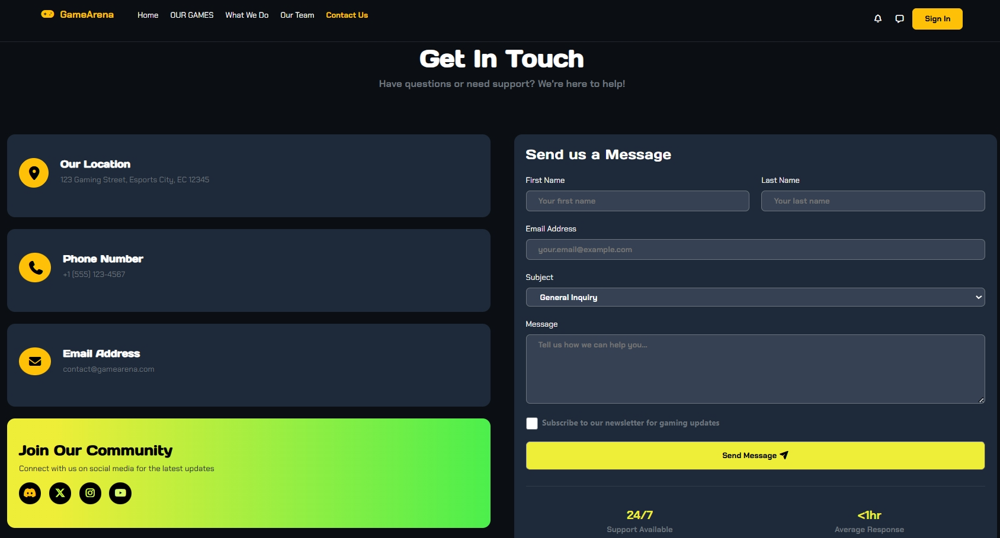
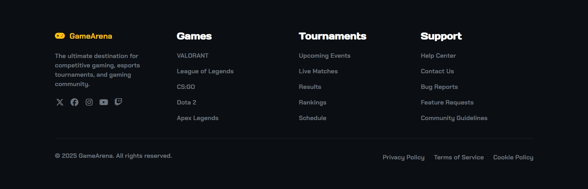

# Games Arena 🎮

A responsive gaming landing page designed for a modern gaming platform, featuring games, team members, services, a contact form, and a structured footer.

## Live Demo

(https://gehhaad.github.io/Games-Arena/)

## Overview

Games Arena is a front-end landing page developed as part of a Bootstrap development assignment.

The project was created based on a provided design reference, with the goal of recreating the landing page while applying Bootstrap, CSS, JavaScript, and responsive design techniques.

The page provides an attractive introduction to the gaming platform and presents its games, services, team members, and contact information in a structured and engaging layout.

## Features

- Responsive navigation
- Hero section introducing Games Arena
- "Our Games" section showcasing available games
- "What We Do" section presenting the platform's services
- "Our Team" section showcasing team members
- Contact form
- Responsive footer
- Responsive layout for different screen sizes
- Bootstrap-based layout and components
- Interactive UI elements
- creating a visual hover effect on team member cards using the CSS `backdrop-filter` property.

## Technologies

- HTML5
- CSS3
- JavaScript
- Bootstrap

## Responsive Design

The project uses Bootstrap's responsive grid system along with CSS media queries to create a layout that adapts to different screen sizes.

The page is designed to provide a consistent and user-friendly experience across desktop, tablet, and mobile devices.

## Page Sections

### Hero Section

The main landing section introducing Games Arena with a visually engaging design and a clear introduction to the platform.


### What We Do

A section presenting the main services and activities provided by Games Arena.


### Our Games

A section showcasing the available games and presenting them in an organized and visually appealing layout.


### Our Team

A section introducing the members of the Games Arena team.

Each team member is presented using a dedicated card containing their information.


### Animation


### Contact Form

A contact section that allows visitors to submit their information and get in touch with the platform.


### Footer

A structured footer containing additional information and links related to the website.


## Bootstrap

Bootstrap was used throughout the project to build and organize the layout and create responsive components.

The Bootstrap grid system was used to help structure the different sections of the landing page and make them adaptable to different screen sizes.

## JavaScript

JavaScript was used to add interactive behavior to the page and enhance the user experience.

## CSS

Custom CSS was used alongside Bootstrap to customize the visual appearance of the page and match the provided design reference.

## Project Structure

```text
Games-Arena/
│
├── css/
│   ├── all.min.css
│   ├── bootstrap.min.css
│   ├── index_style.css
│   ├── media_style.css
│
├── js/
│   ├── bootstrap.bundle.min.js
│
├── images/
│   ├── images of projects
│
├── screenshots/
│   ├── screenshots of projects
│
├── webfonts/
│   ├── fonts of projects
│
├── index.html
│
└── README.md
